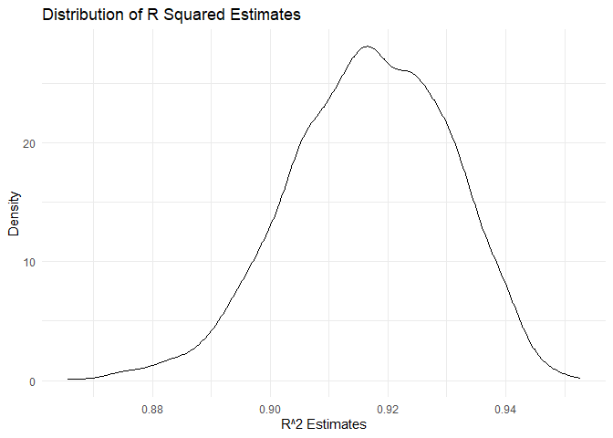
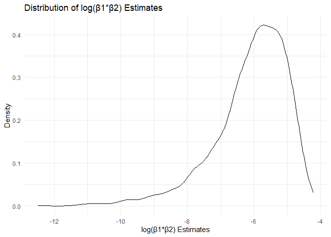

p8105_hw6_yl5508
================
Yifei LIU
2023/11/27

It’s a proj for HW6 about LINEAR MODELS.  

``` r
library(tidyverse)
set.seed(1)
```

## Problem 1

``` r
vic_clean =
  read_csv("./data/homicide-data.csv") |>
  janitor::clean_names() |>
  mutate(city_state = str_c(city, ", ", state)) |>
  mutate(result = case_when(
    disposition == "Closed by arrest" ~ "solved",
    disposition == "Closed without arrest" | disposition == "Open/No arrest" ~ "unsolved"
  )) |>
  filter(city_state != "Dallas, TX") |>
  filter(city_state != "Phoenix, AZ") |>
  filter(city_state != "Kansas City, MO") |>
  filter(city_state != "Tulsa, AL") |>
  filter(victim_race == "White" | victim_race == "Black")
```

## Problem 2

``` r
weather_df = 
  rnoaa::meteo_pull_monitors(
    c("USW00094728"),
    var = c("PRCP", "TMIN", "TMAX"), 
    date_min = "2022-01-01",
    date_max = "2022-12-31") |>
  mutate(
    name = recode(id, USW00094728 = "CentralPark_NY"),
    tmin = tmin / 10,
    tmax = tmax / 10) |>
  select(name, id, everything())
```

    ## using cached file: C:\Users\11480\AppData\Local/R/cache/R/rnoaa/noaa_ghcnd/USW00094728.dly

    ## date created (size, mb): 2023-09-28 10:18:53.408298 (8.541)

    ## file min/max dates: 1869-01-01 / 2023-09-30

``` r
temp_boot =
  weather_df |>
  modelr::bootstrap(n = 50) |>
  mutate(
    models = map(strap, \(df) lm(tmax ~ tmin + prcp, data = df)),
    results = map(models, broom::tidy),
    r_squared = map(models, broom::glance)
  ) |>
  unnest(results) |>
  select(id = .id, term, estimate, r_squared) |>
  pivot_wider(names_from = term, values_from = estimate) |>
  unnest(r_squared) |>
  select(id, r_squared = r.squared, beta_1 = tmin, beta_2 = prcp) |>
  mutate(log_beta = log(beta_1 * beta_2))
```

    ## Warning: There was 1 warning in `mutate()`.
    ## ℹ In argument: `log_beta = log(beta_1 * beta_2)`.
    ## Caused by warning in `log()`:
    ## ! 产生了NaNs

``` r
temp_boot |>
  ggplot(aes(x = r_squared)) +
  geom_density() +
  labs(x = "R^2 Estimates", y = "Density", title = "Distribution of R Squared Estimates") +
  theme_minimal()
```

<!-- -->

``` r
temp_boot |>
  ggplot(aes(x = log_beta)) +
  geom_density() +
  labs(x = "log(β1*β2) Estimates", y = "Density", title = "Distribution of log(β1*β2) Estimates") +
  theme_minimal()
```

    ## Warning: Removed 32 rows containing non-finite values (`stat_density()`).

<!-- -->

``` r
temp_ci =
  temp_boot |> 
  summarize(
    ci_lower_r2 = quantile(r_squared, 0.025), 
    ci_upper_r2 = quantile(r_squared, 0.975),
    ci_lower_log = quantile(log_beta, 0.025, na.rm = TRUE), 
    ci_upper_log = quantile(log_beta, 0.975, na.rm = TRUE)
    )
temp_ci |>
  knitr::kable(digits = 2)
```

| ci_lower_r2 | ci_upper_r2 | ci_lower_log | ci_upper_log |
|------------:|------------:|-------------:|-------------:|
|        0.89 |        0.93 |        -9.03 |         -4.8 |

## Problem 3
