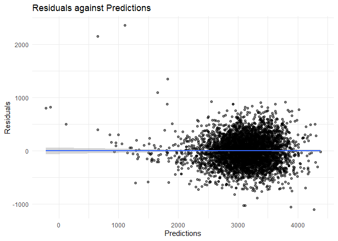
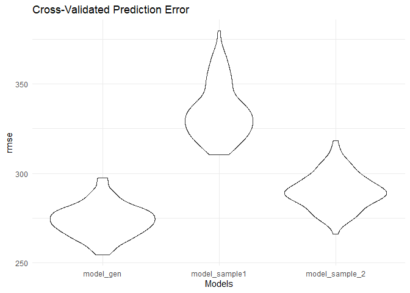

p8105_hw6_yl5508
================
Yifei LIU
2023/11/27

It’s a proj for HW6 about LINEAR MODELS.  

``` r
library(tidyverse)
library(purrr)
library(modelr)
set.seed(1)
```

## Problem 1

``` r
vic_clean =
  read_csv("./data/homicide-data.csv") |>
  janitor::clean_names() |>
  mutate(city_state = str_c(city, ", ", state)) |>
  mutate(result = case_when(
    disposition == "Closed by arrest" ~ "solved",
    disposition == "Closed without arrest" | disposition == "Open/No arrest" ~ "unsolved"
  )) |>
  filter(city_state != "Dallas, TX") |>
  filter(city_state != "Phoenix, AZ") |>
  filter(city_state != "Kansas City, MO") |>
  filter(city_state != "Tulsa, AL") |>
  filter(victim_race == "White" | victim_race == "Black")
```

## Problem 2

``` r
weather_df = 
  rnoaa::meteo_pull_monitors(
    c("USW00094728"),
    var = c("PRCP", "TMIN", "TMAX"), 
    date_min = "2022-01-01",
    date_max = "2022-12-31") |>
  mutate(
    name = recode(id, USW00094728 = "CentralPark_NY"),
    tmin = tmin / 10,
    tmax = tmax / 10) |>
  select(name, id, everything())
```

    ## using cached file: C:\Users\11480\AppData\Local/R/cache/R/rnoaa/noaa_ghcnd/USW00094728.dly

    ## date created (size, mb): 2023-09-28 10:18:53.408298 (8.541)

    ## file min/max dates: 1869-01-01 / 2023-09-30

``` r
temp_boot =
  weather_df |>
  modelr::bootstrap(n = 5000) |>
  mutate(
    models = map(strap, \(df) lm(tmax ~ tmin + prcp, data = df)),
    results = map(models, broom::tidy),
    r_squared = map(models, broom::glance)
  ) |>
  unnest(results) |>
  select(id = .id, term, estimate, r_squared) |>
  pivot_wider(names_from = term, values_from = estimate) |>
  unnest(r_squared) |>
  select(id, r_squared = r.squared, beta_1 = tmin, beta_2 = prcp) |>
  mutate(log_beta = log(beta_1 * beta_2))
```

    ## Warning: There was 1 warning in `mutate()`.
    ## ℹ In argument: `log_beta = log(beta_1 * beta_2)`.
    ## Caused by warning in `log()`:
    ## ! 产生了NaNs

``` r
temp_boot |>
  ggplot(aes(x = r_squared)) +
  geom_density() +
  labs(x = "R^2 Estimates", y = "Density", title = "Distribution of R Squared Estimates") +
  theme_minimal()
```

<!-- -->

``` r
temp_boot |>
  ggplot(aes(x = log_beta)) +
  geom_density() +
  labs(x = "log(β1*β2) Estimates", y = "Density", title = "Distribution of log(β1*β2) Estimates") +
  theme_minimal()
```

    ## Warning: Removed 3361 rows containing non-finite values (`stat_density()`).

<!-- -->

``` r
temp_ci =
  temp_boot |> 
  summarize(
    ci_lower_r2 = quantile(r_squared, 0.025), 
    ci_upper_r2 = quantile(r_squared, 0.975),
    ci_lower_log = quantile(log_beta, 0.025, na.rm = TRUE), 
    ci_upper_log = quantile(log_beta, 0.975, na.rm = TRUE)
    )
temp_ci |>
  knitr::kable(digits = 2)
```

| ci_lower_r2 | ci_upper_r2 | ci_lower_log | ci_upper_log |
|------------:|------------:|-------------:|-------------:|
|        0.89 |        0.94 |        -8.98 |         -4.6 |

## Problem 3

``` r
bw_clean =
  read_csv("./data/birthweight.csv") |>
  janitor::clean_names() |>
  mutate(
    babysex = case_when(
      babysex == 1 ~ "male",
      babysex == 2~ "female"),
    frace = case_when(
      frace == 1 ~ "White",
      frace == 2 ~ "Black",
      frace == 3 ~ "Asian",
      frace == 4 ~ "Puerto Rican",
      frace == 8 ~ "Other",
      frace == 9 ~ "Unknown"),
    malform = case_when(
      malform == 0 ~ 'absent',
      malform == 1 ~ 'present'),
    mrace = case_when(
      mrace == 1 ~ "White",
      mrace == 2 ~ "Black",
      mrace == 3 ~ "Asian",
      mrace == 4 ~ "Puerto Rican",
      mrace == 8 ~ "Other")
  ) |>
  select(-pnumlbw, -pnumsga)
```

    ## Rows: 4342 Columns: 20
    ## ── Column specification ────────────────────────────────────────────────────────
    ## Delimiter: ","
    ## dbl (20): babysex, bhead, blength, bwt, delwt, fincome, frace, gaweeks, malf...
    ## 
    ## ℹ Use `spec()` to retrieve the full column specification for this data.
    ## ℹ Specify the column types or set `show_col_types = FALSE` to quiet this message.

``` r
sum(is.na(bw_clean))
```

    ## [1] 0

``` r
model_bw = lm(bwt ~ ., data = bw_clean) |>
  step(direction = "both", trace = FALSE)
summary(model_bw) |>
  broom::tidy() |>
  knitr::kable(digits = 3)
```

| term              |  estimate | std.error | statistic | p.value |
|:------------------|----------:|----------:|----------:|--------:|
| (Intercept)       | -6145.151 |   141.950 |   -43.291 |   0.000 |
| babysexmale       |   -28.558 |     8.455 |    -3.378 |   0.001 |
| bhead             |   130.777 |     3.447 |    37.944 |   0.000 |
| blength           |    74.947 |     2.019 |    37.120 |   0.000 |
| delwt             |     4.107 |     0.392 |    10.475 |   0.000 |
| fincome           |     0.318 |     0.175 |     1.820 |   0.069 |
| gaweeks           |    11.592 |     1.462 |     7.929 |   0.000 |
| mheight           |     6.594 |     1.785 |     3.694 |   0.000 |
| mraceBlack        |   -63.906 |    42.366 |    -1.508 |   0.132 |
| mracePuerto Rican |   -25.791 |    45.350 |    -0.569 |   0.570 |
| mraceWhite        |    74.887 |    42.315 |     1.770 |   0.077 |
| parity            |    96.305 |    40.336 |     2.388 |   0.017 |
| ppwt              |    -2.676 |     0.427 |    -6.261 |   0.000 |
| smoken            |    -4.843 |     0.586 |    -8.271 |   0.000 |

``` r
res = bw_clean |>
  modelr::add_predictions(model_bw) |>
  modelr::add_residuals(model_bw)

res |>
  ggplot(aes(x = pred, y = resid)) +
  geom_point(alpha = .5) +
  stat_smooth(method = "lm") +
  labs(x = "Predictions", y = "Residuals", title = "Residuals against Predictions") +
  theme_minimal()
```

    ## `geom_smooth()` using formula = 'y ~ x'

<!-- -->

``` r
model_com_1 = lm(bwt ~ blength + gaweeks, data = bw_clean)
summary(model_com_1)
```

    ## 
    ## Call:
    ## lm(formula = bwt ~ blength + gaweeks, data = bw_clean)
    ## 
    ## Residuals:
    ##     Min      1Q  Median      3Q     Max 
    ## -1709.6  -215.4   -11.4   208.2  4188.8 
    ## 
    ## Coefficients:
    ##              Estimate Std. Error t value Pr(>|t|)    
    ## (Intercept) -4347.667     97.958  -44.38   <2e-16 ***
    ## blength       128.556      1.990   64.60   <2e-16 ***
    ## gaweeks        27.047      1.718   15.74   <2e-16 ***
    ## ---
    ## Signif. codes:  0 '***' 0.001 '**' 0.01 '*' 0.05 '.' 0.1 ' ' 1
    ## 
    ## Residual standard error: 333.2 on 4339 degrees of freedom
    ## Multiple R-squared:  0.5769, Adjusted R-squared:  0.5767 
    ## F-statistic:  2958 on 2 and 4339 DF,  p-value: < 2.2e-16

``` r
model_com_2 = lm(bwt ~ bhead * blength * babysex, data = bw_clean)
summary(model_com_2)
```

    ## 
    ## Call:
    ## lm(formula = bwt ~ bhead * blength * babysex, data = bw_clean)
    ## 
    ## Residuals:
    ##      Min       1Q   Median       3Q      Max 
    ## -1132.99  -190.42   -10.33   178.63  2617.96 
    ## 
    ## Coefficients:
    ##                             Estimate Std. Error t value Pr(>|t|)    
    ## (Intercept)                -801.9487  1102.3077  -0.728 0.466948    
    ## bhead                       -16.5975    34.0916  -0.487 0.626388    
    ## blength                     -21.6460    23.3720  -0.926 0.354421    
    ## babysexmale               -6374.8684  1677.7669  -3.800 0.000147 ***
    ## bhead:blength                 3.3244     0.7126   4.666 3.17e-06 ***
    ## bhead:babysexmale           198.3932    51.0917   3.883 0.000105 ***
    ## blength:babysexmale         123.7729    35.1185   3.524 0.000429 ***
    ## bhead:blength:babysexmale    -3.8781     1.0566  -3.670 0.000245 ***
    ## ---
    ## Signif. codes:  0 '***' 0.001 '**' 0.01 '*' 0.05 '.' 0.1 ' ' 1
    ## 
    ## Residual standard error: 287.7 on 4334 degrees of freedom
    ## Multiple R-squared:  0.6849, Adjusted R-squared:  0.6844 
    ## F-statistic:  1346 on 7 and 4334 DF,  p-value: < 2.2e-16

``` r
cv_bw =
  modelr::crossv_mc(bw_clean, 100)

cv_bw_rmse =
  cv_bw |>
  mutate(
    model_cv_full = map(cv_bw$train, 
                         \(df) lm(bwt ~ ., data = (df)) |>
                           step(direction = "both", trace = FALSE)),
    model_sample1 = map(cv_bw$train, 
                         \(df) lm(bwt ~ blength + gaweeks, data = (df))),
    model_sample2 = map(cv_bw$train, 
                         \(df) lm(bwt ~ bhead * blength * babysex, data = (df)))
  ) |>
  mutate(
    errs_cv_full = purrr::map2_dbl(model_cv_full, cv_bw$test, rmse),
    errs_sample1 = purrr::map2_dbl(model_sample1, cv_bw$test, rmse),
    errs_sample2 = purrr::map2_dbl(model_sample2, cv_bw$test, rmse)
  )

cv_bw_rmse |>
  select(model_gen = errs_cv_full,
         model_sample1 = errs_sample1,
         model_sample_2 = errs_sample2) |>
  pivot_longer(everything(), 
               names_to = "models",
               values_to = "rmse") |>
  mutate(model = factor(models, levels = c("model_gen", "model_sample1", "model_sample_2"))) |>
  ggplot(aes(x = model, y = rmse)) +
  geom_violin() +
  labs(x = "Models", y = "rmse", title = "Cross-Validated Prediction Error") +
  theme_minimal()
```

<!-- -->
